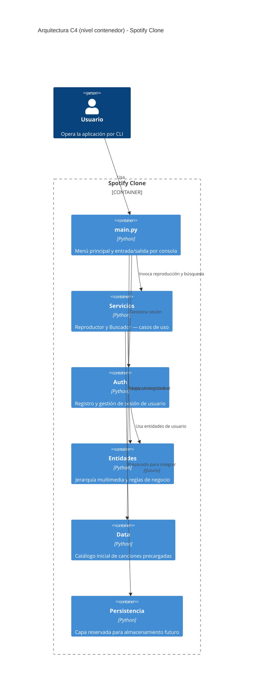

# Spotify Clone

Aplicación de consola para gestionar canciones, podcasts, álbumes y playlists, con separación por capas (`entidades`, `servicios`, `auth`, `data`) y jerarquía de clases multimedia mediante herencia y polimorfismo.

## Objetivo del proyecto

Este repositorio implementa un dominio académico de gestor musical al estilo Spotify con foco en:

- modelado orientado a objetos y encapsulación
- herencia y polimorfismo (`Multimedia` abstracta y sus variantes)
- excepciones personalizadas de dominio (`CalidadInsuficienteError`)
- arquitectura por capas con dependencias dirigidas (`main -> servicios/auth -> entidades`)

## Requisitos

- Python 3.12 o superior
- `Jinja2` (ver `requirements.txt`)

## Instalación rápida

```bash
python3 -m venv .venv
source .venv/bin/activate
pip install -r requirements.txt
```

## Cómo ejecutar la aplicación

```bash
python main.py
```

`main.py` inicializa el catálogo, el reproductor, el buscador y el gestor de autenticación, y arranca el menú principal por consola.

## Flujo disponible en la CLI

Menú principal (`main.py`):

1. Gestión de canciones (añadir, buscar, reproducir)
2. Gestión de podcasts
3. Gestión de álbumes (crear, añadir canciones, reproducir)
4. Gestión de playlists (crear, añadir contenido, fusionar, cambiar visibilidad)
5. Reproductor (cola de reproducción, siguiente pista, ver cola)
6. Búsqueda (por título/autor, género, tema, artista, duración)
7. Autenticación (registro, login, logout)
0. Salir

## Reglas de dominio más importantes

- `Multimedia` es la clase abstracta base; obliga a implementar `reproducir()` en todas las subclases (`entidades/multimedia.py`).
- `Audio` extiende `Multimedia` añadiendo `bitrate` y `canales`, con validación mediante `@property` (`entidades/audio.py`).
- `Cancion` exige un bitrate mínimo de 64 kbps y lanza `CalidadInsuficienteError` si no se cumple; las canciones por encima de 192 kbps se marcan como PRO (`entidades/cancion.py`).
- `Podcast` limita el bitrate a 98 kbps y usa canal Mono (`entidades/podcast.py`).
- `Agrupacion` es la clase base de `Album` y `Playlist`, implementando `__len__`, `__iter__` y detección de duplicados vía `__eq__` (`entidades/agrupacion.py`).
- `Album` restringe la adición de canciones al artista del álbum (`entidades/album.py`).
- `Playlist` soporta fusión con `+`, cambio de visibilidad y encadenamiento de métodos (`entidades/playlist.py`).
- `Reproductor` gestiona una cola de reproducción siguiendo el principio de responsabilidad única (`servicios/reproductor.py`).
- `Buscador` permite filtrar por texto, tipo, género, tema, artista y duración (`servicios/buscador.py`).
- `GestorAuth` maneja registro, login y logout de usuarios con sesión activa (`auth/gestor_auth.py`).

## Arquitectura y estructura

```text
spotify_clone/
├── entidades/     # Dominio puro: jerarquía multimedia y reglas de negocio
├── servicios/     # Casos de uso: reproductor y buscador
├── auth/          # Autenticación separada: registro y sesión
├── data/          # Catálogo inicial de canciones (datos simulados)
├── persistencia/  # Reservado para persistencia futura
└── main.py        # Punto de entrada y menú principal
```

### Responsabilidades por capa

- `entidades/`: invariantes, estado y comportamiento de cada tipo multimedia.
- `servicios/`: coordinación para reproducción y búsqueda (sin I/O de consola propia).
- `auth/`: gestión de usuarios y sesiones, aislada del dominio musical.
- `data/`: catálogo precargado de canciones para inicializar la biblioteca.
- `persistencia/`: preparada para evolucionar a almacenamiento real.

## Ejecutar la aplicación

```bash
python main.py
```

No hay suite de tests en este proyecto. La verificación se realiza ejecutando el menú interactivo.

## Ejemplo rápido de uso en código

```python
from entidades.cancion import Cancion
from entidades.playlist import Playlist

cancion = Cancion("Blinding Lights", "The Weeknd", [], 200, "bl.jpg", 320, "Synthwave")
playlist = Playlist("Artur", "Mis favoritas")
playlist.añadir_contenido(cancion)

print(playlist)
cancion.reproducir()
```

## Diagrama UML de clases (Mermaid)


## Diagrama de arquitectura C4 (Mermaid)



## Estado actual y evolución

- Persistencia real aún no implementada (`persistencia/` es un placeholder).
- El catálogo inicial se carga desde `data/catalogo.py` con datos simulados en memoria.
- La autenticación no persiste entre sesiones (usuarios se pierden al cerrar).
