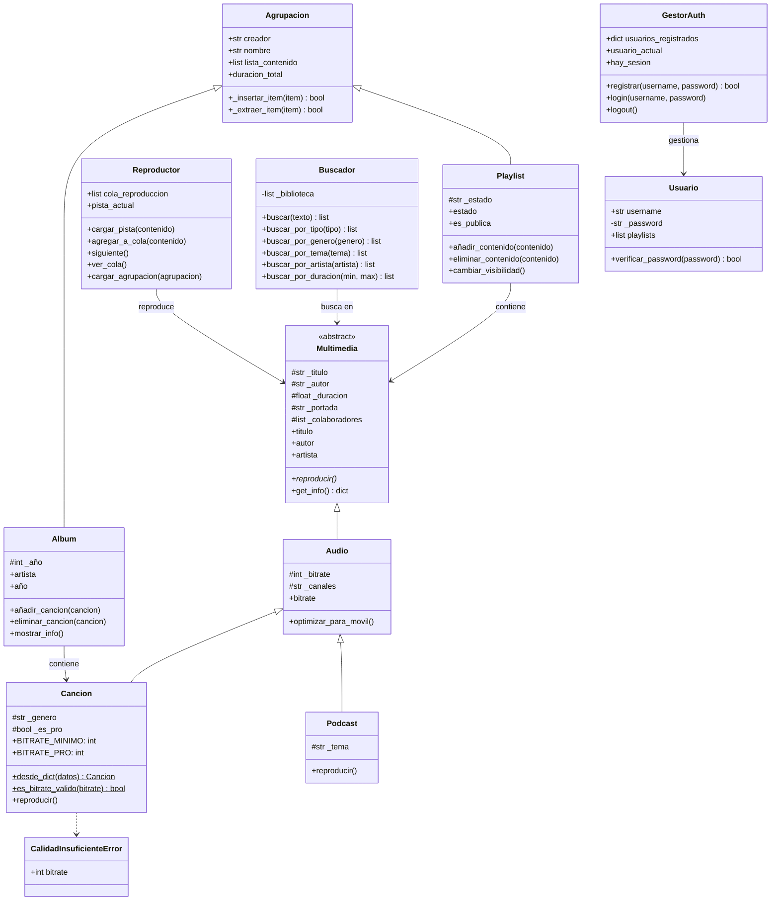
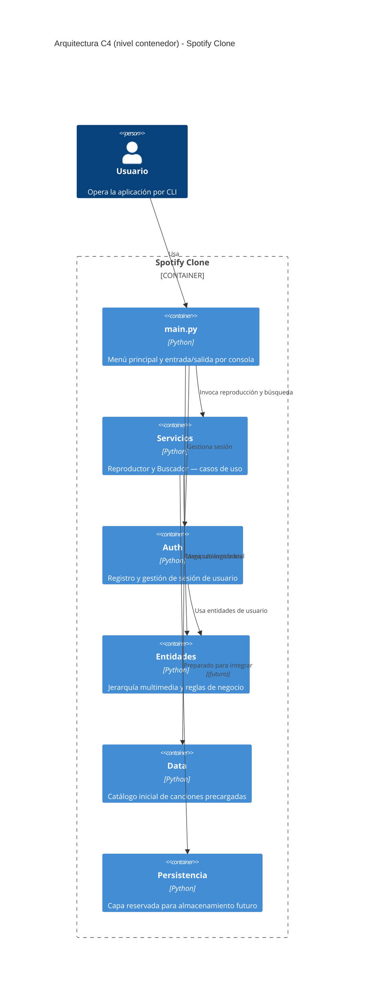

# Spotify Clone

Aplicación de consola para gestionar canciones, podcasts, álbumes y playlists, con separación por capas (`entidades`, `servicios`, `auth`, `data`) y jerarquía de clases multimedia mediante herencia y polimorfismo.

## Objetivo del proyecto

Este repositorio implementa un dominio académico de gestor musical al estilo Spotify con foco en:

- modelado orientado a objetos y encapsulación
- herencia y polimorfismo (`Multimedia` abstracta y sus variantes)
- excepciones personalizadas de dominio (`CalidadInsuficienteError`)
- arquitectura por capas con dependencias dirigidas (`main -> servicios/auth -> entidades`)

## Requisitos

- Python 3.12 o superior
- `Jinja2` (ver `requirements.txt`)

## Instalación rápida

```bash
python3 -m venv .venv
source .venv/bin/activate
pip install -r requirements.txt
```

## Cómo ejecutar la aplicación

```bash
python main.py
```

`main.py` inicializa el catálogo, el reproductor, el buscador y el gestor de autenticación, y arranca el menú principal por consola.

## Guía de prueba paso a paso

Sigue este orden exacto. Copia y pega los datos cuando te pida algo.

### Arrancar el programa

```bash
python main.py
```

Deberías ver:
```
════════════════════════════════════════════
   🎵  SPOTIFY CLONE  —  Artur & Pepe
   Catálogo cargado: 65 canciones
════════════════════════════════════════════
```

---

### Paso 1 — Cuenta (opción 8)

```
Elige: 8
Elige: 2      ← Registrarse
Nuevo usuario: artur
Contraseña: 1234
```

Deberías ver `✅ Usuario registrado`. Luego inicia sesión:

```
Elige: 1      ← Iniciar sesión
Usuario: artur
Contraseña: 1234
```

El menú debe mostrar `[artur]` en vez de `[Invitado]`.

```
Elige: 0      ← volver al menú principal
```

---

### Paso 2 — Biblioteca (opción 1)

```
Elige: 1
```

Deberías ver las 65 canciones del catálogo con iconos 👑 PRO. Pulsa Enter para volver.

---

### Paso 3 — Añadir canción correcta (opción 2)

```
Elige: 2
Género: Rock
Título: Thunderstruck
Autor: AC/DC
Colaboradores: (Enter — ninguno)
Portada: thunder.jpg
Duración: 292
Bitrate: 320
```

Deberías ver `✅ 'Thunderstruck' añadida a la biblioteca.`

---

### Paso 4 — Añadir canción con bitrate CUTRE (opción 2)

```
Elige: 2
Género: Pop
Título: Canción Cutre
Autor: DJ Malo
Colaboradores: (Enter)
Portada: (Enter)
Duración: 180
Bitrate: 100
```

Deberías ver `⚠️ 'Canción Cutre' tiene un bitrate de 100. Es calidad cutre.` y luego `✅ añadida`.

---

### Paso 5 — Añadir canción que FALLA (opción 2)

Prueba `CalidadInsuficienteError` y escritura en `persistencia/errores.txt`.

```
Elige: 2
Género: Trap
Título: Canción Rota
Autor: Nadie
Colaboradores: (Enter)
Portada: (Enter)
Duración: 120
Bitrate: 32
```

Deberías ver `❌ No se pudo añadir: Bitrate 32kbps insuficiente.` Comprueba el fichero:

```bash
cat persistencia/errores.txt
```

---

### Paso 6 — Añadir podcast (opción 3)

```
Elige: 3
Tema: Tecnología
Título: Python para todos
Autor: Guido van Rossum
Colaboradores: Artur, Pepe
Portada: (Enter)
Duración: 3600
Bitrate: 256
```

Deberías ver `✅ Podcast 'Python para todos' añadido.` El bitrate se capará a 98kbps automáticamente.

---

### Paso 7 — Buscador (opción 4)

**Búsqueda aproximada — opción 1:**
```
Elige: 4 → 1
Buscar: blnding ligh
```
Debe encontrar `Blinding Lights` aunque esté mal escrito.

**Por género — opción 2:**
```
Elige: 2
Género: pop
```
Debe salir todo lo que contenga "pop": Pop, Indie Pop, Electropop, etc.

**Por artista — opción 3:**
```
Elige: 3
Artista: Ariana Grande
```
Debe mostrar también canciones donde Ariana es colaboradora, no solo autora.

**Por duración — opción 4:**
```
Elige: 4
Duración mínima: 200
Duración máxima: 240
```

**Solo canciones — opción 5:** no debe aparecer el podcast.

**Solo podcasts — opción 6:** solo debe aparecer `Python para todos`.

```
Elige: 0
```

---

### Paso 8 — Playlists (opción 5)

```
Elige: 5 → 1
Nombre: Mi Primera Playlist
Visibilidad: (Enter — publica)
```

Añade 3 canciones distintas con la opción 2. Luego intenta añadir la misma dos veces — debe avisar de duplicado.

```
Elige: 3      ← Ver playlist (debe mostrar canciones y duración total)
Elige: 4      ← Cambiar visibilidad (debe pasar a privada)
```

Crea una segunda playlist con 2 canciones distintas y fusiónalas:

```
Elige: 1      ← Nueva playlist: "Segunda Playlist"
Elige: 5      ← Fusionar → selecciona playlist 1 y playlist 2
```

Debe crear una tercera playlist con todas las canciones combinadas.

```
Elige: 0
```

---

### Paso 9 — Álbumes (opción 6)

```
Elige: 6 → 1
Artista: The Weeknd
Nombre: After Hours
Año: 2020
```

```
Elige: 2      ← Añadir canción
```

Solo aparecerán canciones de `The Weeknd`. Selecciona una. Comprueba que no puedes añadir canciones de otro artista.

```
Elige: 3      ← Ver álbum
Elige: 0
```

---

### Paso 10 — Reproductor (opción 7)

```
Elige: 7 → 1
(selecciona cualquier canción)
```

Debe reproducir y registrar en `data/historial.txt`.

```
Elige: 2      ← Añade 3 canciones a la cola
Elige: 6      ← Ver cola (deben aparecer las 3)
Elige: 3      ← Siguiente (repite un par de veces)
Elige: 4      ← Cargar playlist en cola
Elige: 7      ← Vaciar cola
Elige: 6      ← Ver cola (debe estar vacía)
Elige: 0
```

---

### Paso 11 — Historial (opción 9)

```
Elige: 9
```

Debe mostrar todas las reproducciones con fecha y hora. Comprueba también el fichero directamente:

```bash
cat data/historial.txt
```

---

### Paso 12 — Validación de robustez

Vuelve a añadir una canción (opción 2) y cuando pida duración escribe:

```
Duración: hola
```

Debe responder `Introduce un número` sin petar. Escribe `200` y continúa normal.

---

### Paso 13 — Salir (opción 0)

```
Elige: 0
```

Debe mostrar `👋 ¡Hasta luego!` y cerrar limpio.

---

### Comprobación final de ficheros

```bash
cat data/historial.txt
cat persistencia/errores.txt
```

`historial.txt` debe tener una línea por cada reproducción del paso 10.  
`errores.txt` debe tener la línea del bitrate 32 kbps del paso 5.  
Si los dos tienen contenido, la persistencia funciona correctamente.

## Flujo disponible en la CLI

Menú principal (`main.py`):

1. Gestión de canciones (añadir, buscar, reproducir)
2. Gestión de podcasts
3. Gestión de álbumes (crear, añadir canciones, reproducir)
4. Gestión de playlists (crear, añadir contenido, fusionar, cambiar visibilidad)
5. Reproductor (cola de reproducción, siguiente pista, ver cola)
6. Búsqueda (por título/autor, género, tema, artista, duración)
7. Autenticación (registro, login, logout)
0. Salir

## Reglas de dominio más importantes

- `Multimedia` es la clase abstracta base; obliga a implementar `reproducir()` en todas las subclases (`entidades/multimedia.py`).
- `Audio` extiende `Multimedia` añadiendo `bitrate` y `canales`, con validación mediante `@property` (`entidades/audio.py`).
- `Cancion` exige un bitrate mínimo de 64 kbps y lanza `CalidadInsuficienteError` si no se cumple; las canciones por encima de 192 kbps se marcan como PRO (`entidades/cancion.py`).
- `Podcast` limita el bitrate a 98 kbps y usa canal Mono (`entidades/podcast.py`).
- `Agrupacion` es la clase base de `Album` y `Playlist`, implementando `__len__`, `__iter__` y detección de duplicados vía `__eq__` (`entidades/agrupacion.py`).
- `Album` restringe la adición de canciones al artista del álbum (`entidades/album.py`).
- `Playlist` soporta fusión con `+`, cambio de visibilidad y encadenamiento de métodos (`entidades/playlist.py`).
- `Reproductor` gestiona una cola de reproducción siguiendo el principio de responsabilidad única (`servicios/reproductor.py`).
- `Buscador` permite filtrar por texto, tipo, género, tema, artista y duración (`servicios/buscador.py`).
- `GestorAuth` maneja registro, login y logout de usuarios con sesión activa (`auth/gestor_auth.py`).

## Arquitectura y estructura

```text
spotify_clone/
├── entidades/     # Dominio puro: jerarquía multimedia y reglas de negocio
├── servicios/     # Casos de uso: reproductor y buscador
├── auth/          # Autenticación separada: registro y sesión
├── data/          # Catálogo inicial de canciones (datos simulados)
├── persistencia/  # Reservado para persistencia futura
└── main.py        # Punto de entrada y menú principal
```

### Responsabilidades por capa

- `entidades/`: invariantes, estado y comportamiento de cada tipo multimedia.
- `servicios/`: coordinación para reproducción y búsqueda (sin I/O de consola propia).
- `auth/`: gestión de usuarios y sesiones, aislada del dominio musical.
- `data/`: catálogo precargado de canciones para inicializar la biblioteca.
- `persistencia/`: preparada para evolucionar a almacenamiento real.

## Ejecutar la aplicación

```bash
python main.py
```

No hay suite de tests en este proyecto. La verificación se realiza ejecutando el menú interactivo.

## Ejemplo rápido de uso en código

```python
from entidades.cancion import Cancion
from entidades.playlist import Playlist

cancion = Cancion("Blinding Lights", "The Weeknd", [], 200, "bl.jpg", 320, "Synthwave")
playlist = Playlist("Artur", "Mis favoritas")
playlist.añadir_contenido(cancion)

print(playlist)
cancion.reproducir()
```

## Diagrama UML de clases (Mermaid)



## Diagrama de arquitectura C4 (Mermaid)



## Estado actual y evolución

- Persistencia real aún no implementada (`persistencia/` es un placeholder).
- El catálogo inicial se carga desde `data/catalogo.py` con datos simulados en memoria.
- La autenticación no persiste entre sesiones (usuarios se pierden al cerrar).
